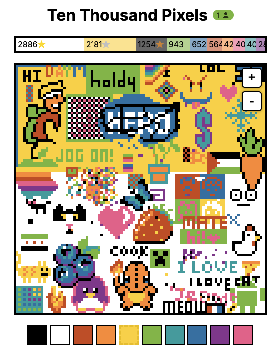

# Ten Thousand Pixels

A real-time collaborative pixel art canvas where users can draw pixels and see live updates (similar to Reddit's r/place)

- Frontend
  - HTML
  - CSS
  - JavaScript
  - HTML5 Canvas
- Backend
  - Go
  - Websocket
- Data storage
  - Redis

Deployed using Vercel, fly.io, and Managed Redis.
